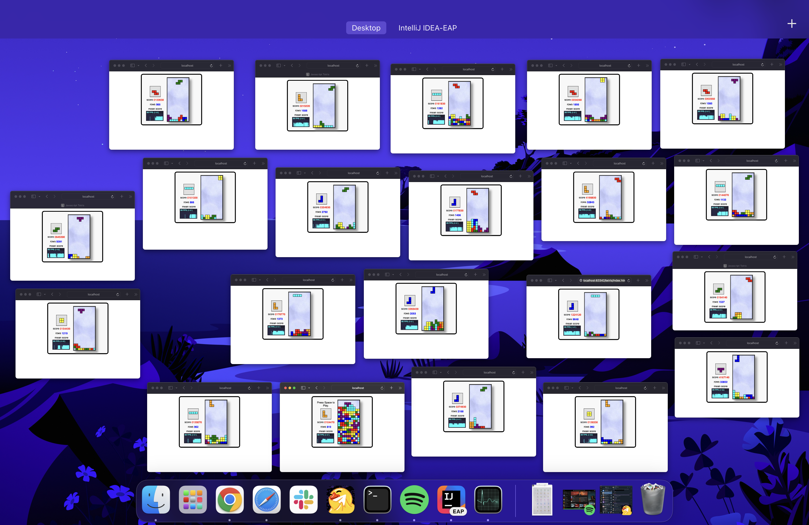
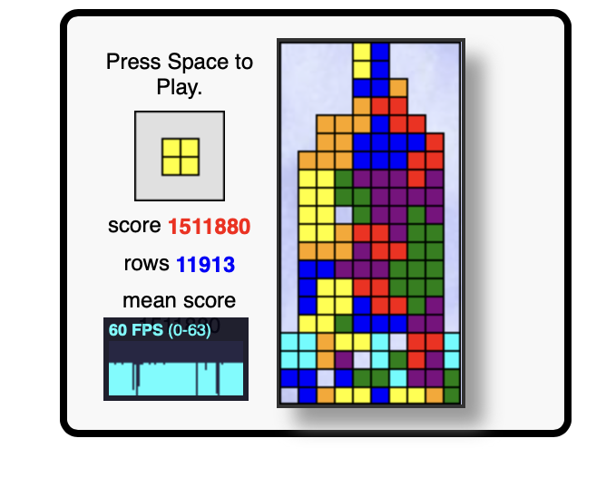
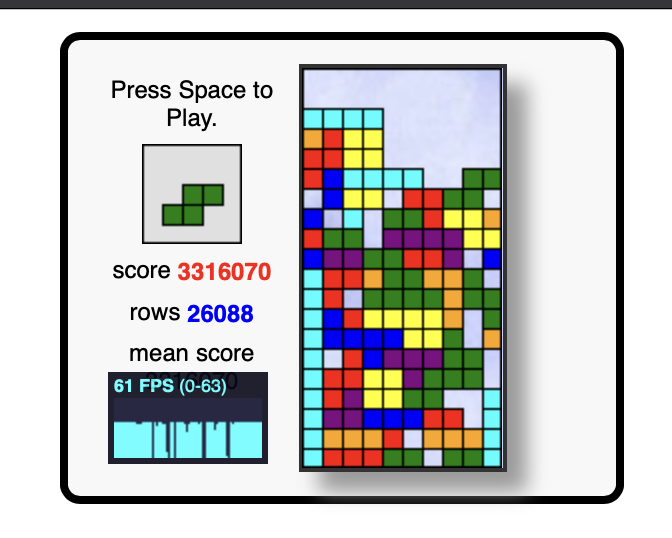

# Tetris Game Report

After I opened and took a look at the structure of the game, I noticed some bugs:

1. Null bug — deleted rows are shown as "null," but it needed to be zero
2. Size error — since particles have different horizontal lengths depending on the direction, I just calculate it manually based on the binary matrix representation.

```
function getPieceSize(block) {
    let binaryString = block.toString(2).padStart(16, '0');

    let columnsWithOnes = [0, 0, 0, 0];

    for (let i = 0; i < 4; i++) {
        let row = binaryString.slice(i * 4, (i + 1) * 4);
        for (let j = 0; j < 4; j++) {
            if (row[j] === '1') {
                columnsWithOnes[j] = 1;
            }
        }
    }

    return columnsWithOnes.reduce((sum, col) => sum + col, 0);
}
```

3. Shift error — since we are placing not exactly particles, rather the blocks with some of the pixels colored, the
```
0100
0100
0100
0100
```
(blue particle) had an issue because we can't place it in the first x that way, therefore, I "shifted" every particle I could to fix it.
So now it's
```
1000
1000
1000
1000
```

4. Piece bug — the piece is not deepcopying correctly, so it had an issue with a direction, because when we changed it in cycle, we changed it everywhere.

After that, it started working normally!

And then, I applied the Beam Search algorithm (I used a non-recursive version for efficiency)
Honestly, I think that the configuration with length 2 with all possible paths, and then count it.
I made a lot of tests, and even had the one with 10.000.000 score points!!


https://github.com/user-attachments/assets/24f1bb09-a2a0-42d8-a3c0-1d47369dcddd


(I had a lot of tests)

Also, I realized that the basic algorithm almost everytime ends in a hill-like structure, 
therefore, I tried to fix this via making fines for high columns.
Hence, it started to look normal, but it actually slightly worsened the results.

(hill and normal)

I think since the simple 2-path algorithm works like an hour and a half, there is simply no sense in making 3-path and more.
Since it really affects the performance, because the first two variants are 36X36 moves per TURN, counting something more complex
will be terrible — we need to count for every particle all possible moves multiplied by 36X36. 

For testing purposes I implemented "test mode," you need to start the game by clicking on the space button, and then press M button;
right after that it will use my algorithm only. 
Also, I added mean score (it updates after losing).


It was a perfect experience, and now I get why people use TypeScript.
